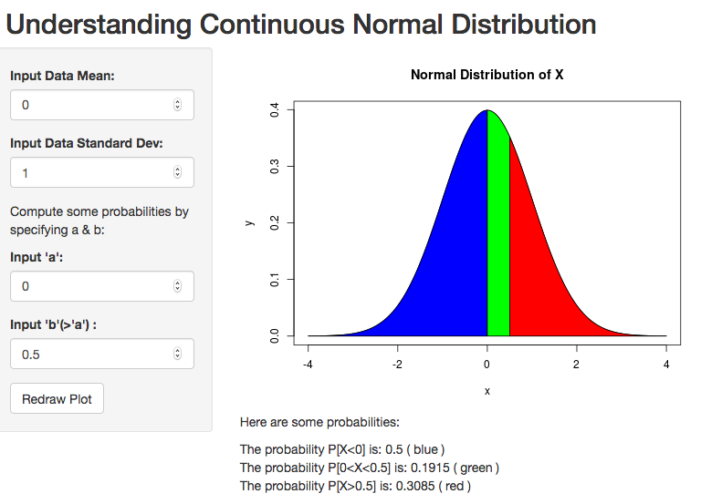
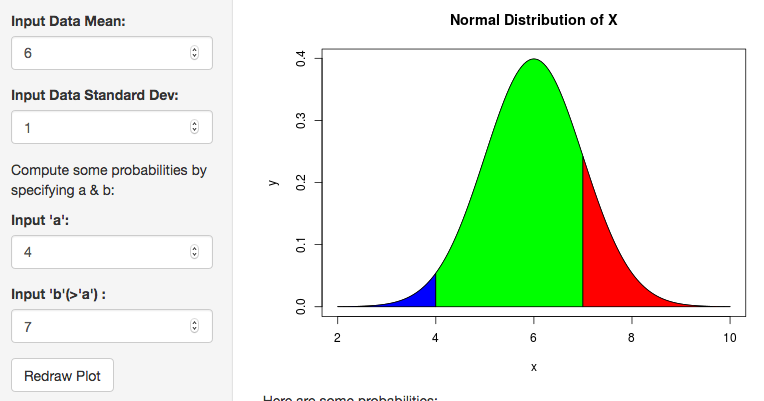

### Your Normal Distribution

Would you like to a see a plot of normal distribution whose parameters you can change?

Would you like to see geometric interpretation of the probabilities computed under the distribution?

Then here is a short presentation of the application.

--- .class1 #id1 bg:wheat

### The Application
If you go to the application's web site, this is what you will see, the plot of standard normal distribution:



--- .class1 #id2 bg:wheat

### Supply your own parameters!
Here is what happens when you change some parameters/inputs:



--- .class1 #id3 bg:wheat

### A Few Usual Probabilities
If you want to know the value of a typical probability of some range, say, P[a<X<b] given that the mean and standard deviations are set 6 and 1.0, and a and b are set to 4 and 7, respectively, the application will compute it for you (rounded off) as:


```
## [1] "P[4<X<7] = 0.8186"
```

--- .class1 #id4 bg:wheat

### Like the Application?

If you think it is worthwhile application, then click the link below:

[Understanding Your Normal Distribution](https://saturn-ds.shinyapps.io/KnowingNormalDistribution/)


